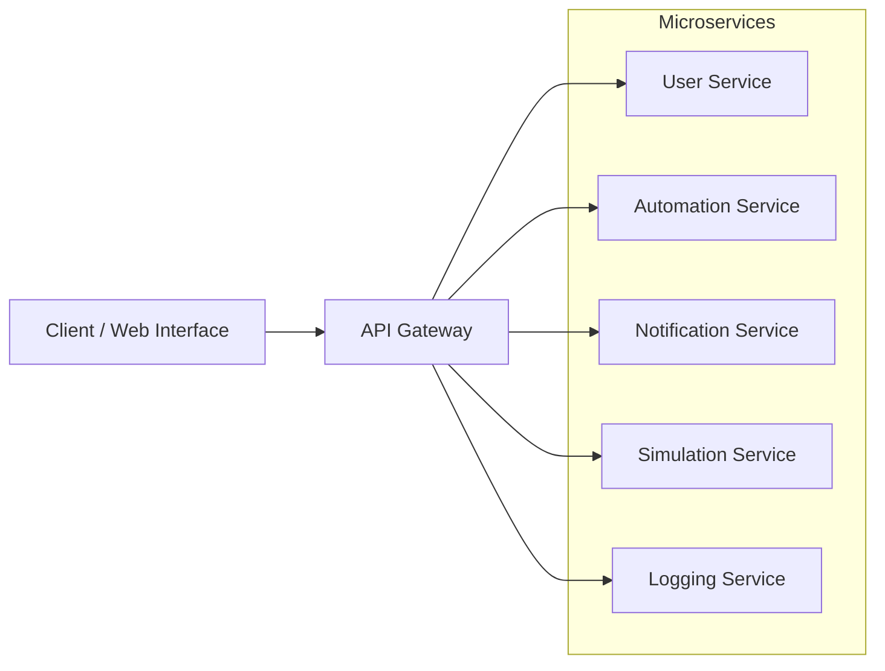
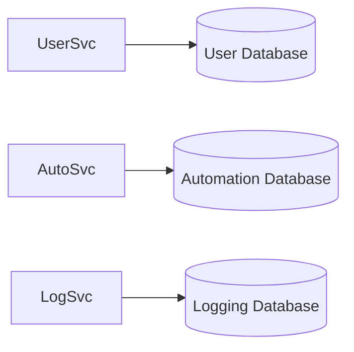
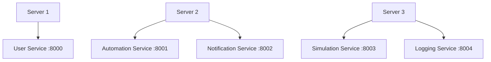
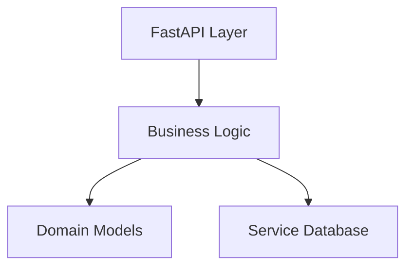
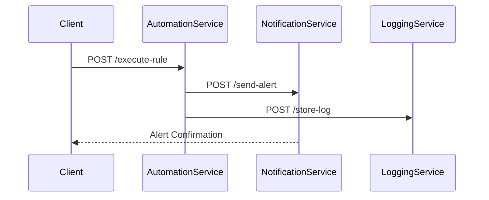
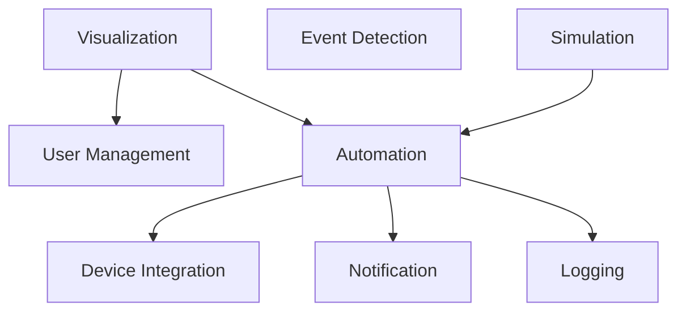

# Digital Twin–Based Industrial Automation System Architecture

## I. Selected Software Architecture Style  
### Microservices Architecture

The Digital Twin–Based Industrial Automation System adopts a **Microservices Architecture**, where the system is decomposed into independently deployable services. Each service runs as a separate FastAPI application and communicates through REST APIs over HTTP.

Each microservice:

- Operates as an independent Python runtime process  
- Exposes well-defined REST endpoints  
- Owns its business logic and data  
- Communicates via JSON-based API contracts  
- Can scale independently  

This design ensures loose coupling, fault isolation, and distributed scalability.

---

# High-Level Architecture Overview

The API Gateway routes external requests to appropriate services.

---

## Granularity of Components

The system follows fine-grained service decomposition. Each service represents a **bounded context** and encapsulates a single business capability.

---

## Identified Microservices

### 1. User Service
- Authentication  
- Role-based authorization  
- Token/session validation  
- User data management  

### 2. Automation Service
- Rule evaluation engine  
- Condition–action processing  
- Machine control command generation  
- Event-driven execution  

### 3. Notification Service
- Alert generation  
- Fault escalation  
- External communication handling  

### 4. Simulation Service
- Virtual factory modeling  
- Predictive scenario analysis  
- Performance estimation  

### 5. Logging Service
- Persistent log storage  
- Audit trail management  
- Historical event tracking  

---

## Data Ownership Model

Each microservice owns its database and does not directly access other service databases, ensuring decentralized data management.

---

## Independent Deployment Model

Each service runs independently on a separate port using APIs, confirming independent deployment.

---

## Internal Structure of a Microservice

Internally, each microservice may follow a layered structure while remaining externally independent.

---

# Granularity Characteristics

The architecture satisfies microservices principles because:

- Services encapsulate a single bounded context  
- Services are separate FastAPI applications  
- Services run as independent runtime processes  
- Communication occurs via HTTP REST APIs  
- Each service maintains independent data ownership  
- Services scale horizontally without impacting others  

Example deployment ports:

- User Service → `localhost:8000`  
- Automation Service → `localhost:8001`  
- Notification Service → `localhost:8002`  
- Simulation Service → `localhost:8003`  
- Logging Service → `localhost:8004`  

---

# Inter-Service Communication Flow

Communication is:

- Stateless  
- JSON-based  
- Contract-driven  
- Loosely coupled  

---

# Why did we choose Microservices Architecture

## 1. Scalability

- Services scale independently  
- High-demand services can be replicated  
- No need to scale entire system  

---

## 2. Maintainability

- Clear separation of concerns  
- Independent development and deployment  
- Reduced codebase complexity  
- FastAPI auto-generates OpenAPI documentation  

---

## 3. Fault Isolation

- Failure in one service does not cascade  
- Enables graceful degradation  
- Improves reliability  

---

## 4. Performance Optimization

- Asynchronous FastAPI endpoints improve throughput  
- CPU-intensive automation logic isolated  
- Service-specific resource allocation  

---

## 5. Industrial Alignment

- Digital Twin systems are distributed by nature  
- Supports multi-factory scaling  
- Cloud-ready and edge-compatible  

---

# II. Application Components

## Component-Level Diagram

---

## Component Descriptions

### 1. User Management Component
- Authentication  
- Authorization  
- Role hierarchy  
- Secure credential handling  

### 2. Visualization Component
- Factory floor rendering  
- Real-time monitoring  
- Simulation output display  

### 3. Automation Component
- Rule Engine  
- Condition–action evaluation  
- Control command dispatch  

### 4. Event Detection Component
- Sensor data processing  
- Anomaly detection  
- Fault classification  

### 5. Device Integration Component
- PLC communication  
- Sensor data ingestion  
- Machine state synchronization  

### 6. Notification Component
- Alert generation  
- External messaging  
- Escalation logic  

### 7. Logging Component
- Persistent storage  
- Audit management  
- Secure event tracking  

### 8. Simulation Component
- Predictive modeling  
- Virtual environment testing  
- Scenario analysis  

---

# Conclusion

The Microservices Architecture:

- Independent runtime processes  
- API-driven communication  
- Service autonomy  
- Fault isolation  
- Horizontal scalability  
- Industrial-grade modularity  

This architecture effectively satisfies scalability, maintainability, and performance requirements of the Digital Twin–Based Industrial Automation System.
